# [📈 Live Status](https://upptime.solidops.io): <!--live status--> **🟩 All systems operational**

This repository contains the open-source uptime monitor and status page for [Solidops-io](https://upptime.solidops.io), powered by [Upptime](https://github.com/upptime/upptime).

With [Upptime](https://upptime.js.org), you can get your own unlimited and free uptime monitor and status page, powered entirely by a GitHub repository. We use [Issues](https://github.com/Solidops-io/upptime/issues) as incident reports, [Actions](https://github.com/Solidops-io/upptime/actions) as uptime monitors, and [Pages](https://upptime.solidops.io) for the status page.

<!--start: status pages-->
<!-- This summary is generated by Upptime (https://github.com/upptime/upptime) -->
<!-- Do not edit this manually, your changes will be overwritten -->
<!-- prettier-ignore -->
| URL | Status | History | Response Time | Uptime |
| --- | ------ | ------- | ------------- | ------ |
|  [Posto 3 Palmeiras](https://posto3palmeiras.api.postoaki.com/health) | 🟩 Up | [posto-3-palmeiras.yml](https://github.com/Solidops-io/upptime-postoaki/commits/HEAD/history/posto-3-palmeiras.yml) | 

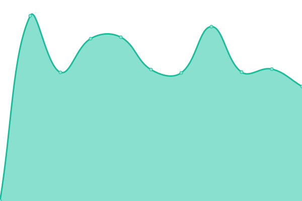 592ms
     
 | 

<a href="https://upptime.solidops.io/history/posto-3-palmeiras">99.83%</a>
    

|  [Rede Roda](https://rederoda.api.postoaki.com/health) | 🟩 Up | [rede-roda.yml](https://github.com/Solidops-io/upptime-postoaki/commits/HEAD/history/rede-roda.yml) | 

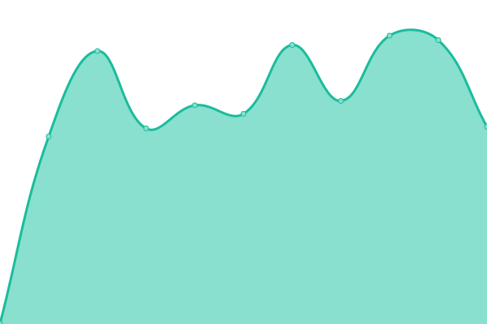 588ms
     
 | 

<a href="https://upptime.solidops.io/history/rede-roda">99.96%</a>
    

|  [Clube Avanth](https://clubeavanth.api.postoaki.com/health) | 🟩 Up | [clube-avanth.yml](https://github.com/Solidops-io/upptime-postoaki/commits/HEAD/history/clube-avanth.yml) | 

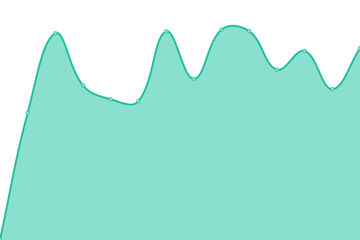 581ms
     
 | 

<a href="https://upptime.solidops.io/history/clube-avanth">99.96%</a>
    

|  [Grupo Parigot](https://grupoparigot.api.postoaki.com/health) | 🟩 Up | [grupo-parigot.yml](https://github.com/Solidops-io/upptime-postoaki/commits/HEAD/history/grupo-parigot.yml) | 

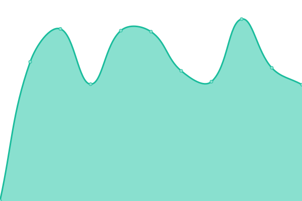 581ms
     
 | 

<a href="https://upptime.solidops.io/history/grupo-parigot">99.96%</a>
    

|  [Club Petrol](https://clubpetrol.api.postoaki.com/health) | 🟩 Up | [club-petrol.yml](https://github.com/Solidops-io/upptime-postoaki/commits/HEAD/history/club-petrol.yml) | 

 568ms
     
 | 

<a href="https://upptime.solidops.io/history/club-petrol">99.96%</a>
    

|  [Premium Combustíveis](https://premiumcombustiveis.api.postoaki.com/health) | 🟩 Up | [premium-combustiveis.yml](https://github.com/Solidops-io/upptime-postoaki/commits/HEAD/history/premium-combustiveis.yml) | 

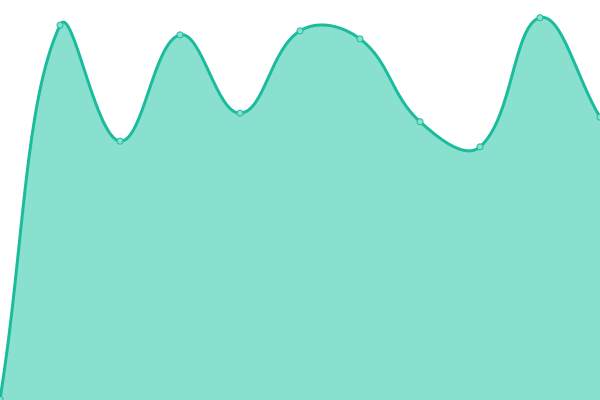 555ms
     
 | 

<a href="https://upptime.solidops.io/history/premium-combustiveis">99.96%</a>
    

|  [Posto do Sergio](https://postodosergio.api.postoaki.com/health) | 🟩 Up | [posto-do-sergio.yml](https://github.com/Solidops-io/upptime-postoaki/commits/HEAD/history/posto-do-sergio.yml) | 

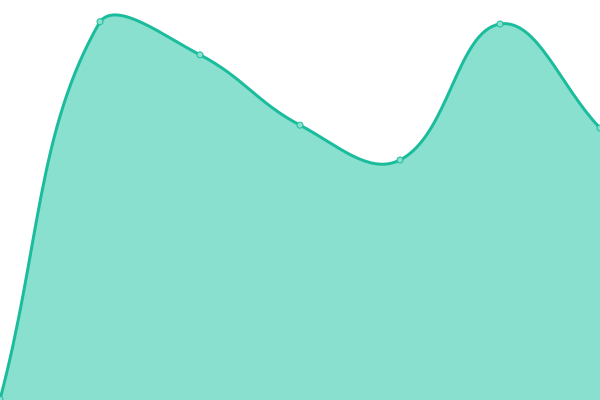 582ms
     
 | 

<a href="https://upptime.solidops.io/history/posto-do-sergio">100.00%</a>
    

|  [Novo Brasil Postos](https://novobrasilpostos.api.postoaki.com/health) | 🟩 Up | [novo-brasil-postos.yml](https://github.com/Solidops-io/upptime-postoaki/commits/HEAD/history/novo-brasil-postos.yml) | 

 535ms
     
 | 

<a href="https://upptime.solidops.io/history/novo-brasil-postos">100.00%</a>
    

|  [Posto Bom Alcool](https://postobomalcool.api.postoaki.com/health) | 🟩 Up | [posto-bom-alcool.yml](https://github.com/Solidops-io/upptime-postoaki/commits/HEAD/history/posto-bom-alcool.yml) | 

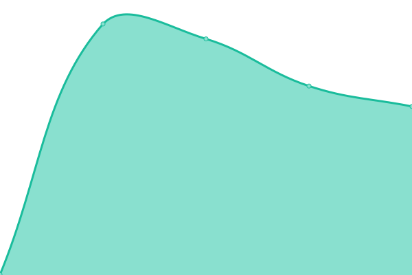 574ms
     
 | 

<a href="https://upptime.solidops.io/history/posto-bom-alcool">100.00%</a>
    

|  [Posto Divisa](https://postodivisa.api.postoaki.com/health) | 🟩 Up | [posto-divisa.yml](https://github.com/Solidops-io/upptime-postoaki/commits/HEAD/history/posto-divisa.yml) | 

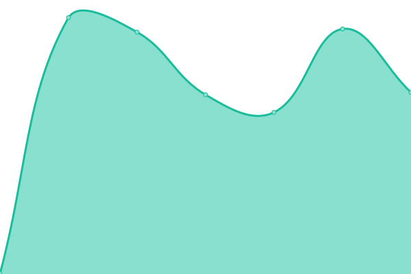 577ms
     
 | 

<a href="https://upptime.solidops.io/history/posto-divisa">100.00%</a>
    

|  [P5](https://p5.api.postoaki.com/health) | 🟩 Up | [p5.yml](https://github.com/Solidops-io/upptime-postoaki/commits/HEAD/history/p5.yml) | 

 595ms
     
 | 

<a href="https://upptime.solidops.io/history/p5">100.00%</a>
    

|  [Rede América](https://redeamerica.api.postoaki.com/health) | 🟩 Up | [rede-america.yml](https://github.com/Solidops-io/upptime-postoaki/commits/HEAD/history/rede-america.yml) | 

 568ms
     
 | 

<a href="https://upptime.solidops.io/history/rede-america">100.00%</a>
    

|  [Posto São João](https://postosaojoao.api.postoaki.com/health) | 🟩 Up | [posto-sao-joao.yml](https://github.com/Solidops-io/upptime-postoaki/commits/HEAD/history/posto-sao-joao.yml) | 

 582ms
     
 | 

<a href="https://upptime.solidops.io/history/posto-sao-joao">100.00%</a>
    

|  [Rede de Postos FKD](https://redefkd.api.postoaki.com/health) | 🟩 Up | [rede-de-postos-fkd.yml](https://github.com/Solidops-io/upptime-postoaki/commits/HEAD/history/rede-de-postos-fkd.yml) | 

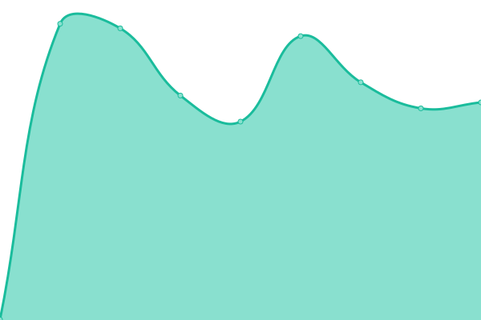 592ms
     
 | 

<a href="https://upptime.solidops.io/history/rede-de-postos-fkd">100.00%</a>
    

|  [Rede 7](https://redesete.api.postoaki.com/health) | 🟩 Up | [rede-7.yml](https://github.com/Solidops-io/upptime-postoaki/commits/HEAD/history/rede-7.yml) | 

 602ms
     
 | 

<a href="https://upptime.solidops.io/history/rede-7">100.00%</a>
    

|  [Posto Santa Cecília](https://postosantacecilia.api.postoaki.com/health) | 🟩 Up | [posto-santa-cecilia.yml](https://github.com/Solidops-io/upptime-postoaki/commits/HEAD/history/posto-santa-cecilia.yml) | 

 615ms
     
 | 

<a href="https://upptime.solidops.io/history/posto-santa-cecilia">100.00%</a>
    

|  [Rede Mourão](https://redemourao.api.postoaki.com/health) | 🟩 Up | [rede-mourao.yml](https://github.com/Solidops-io/upptime-postoaki/commits/HEAD/history/rede-mourao.yml) | 

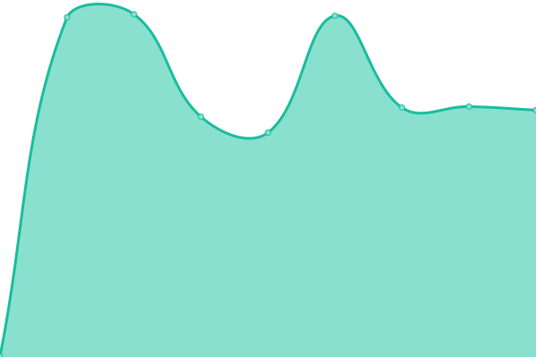 603ms
     
 | 

<a href="https://upptime.solidops.io/history/rede-mourao">100.00%</a>
    

|  [Rede J Amaral](https://redejamaral.api.postoaki.com/health) | 🟩 Up | [rede-j-amaral.yml](https://github.com/Solidops-io/upptime-postoaki/commits/HEAD/history/rede-j-amaral.yml) | 

 616ms
     
 | 

<a href="https://upptime.solidops.io/history/rede-j-amaral">100.00%</a>
    

|  [Auto Posto Imperatriz](https://autopostoimperatriz.api.postoaki.com/health) | 🟩 Up | [auto-posto-imperatriz.yml](https://github.com/Solidops-io/upptime-postoaki/commits/HEAD/history/auto-posto-imperatriz.yml) | 

 582ms
     
 | 

<a href="https://upptime.solidops.io/history/auto-posto-imperatriz">100.00%</a>
    

|  [Posto Uni](https://postouni.api.postoaki.com/health) | 🟩 Up | [posto-uni.yml](https://github.com/Solidops-io/upptime-postoaki/commits/HEAD/history/posto-uni.yml) | 

 589ms
     
 | 

<a href="https://upptime.solidops.io/history/posto-uni">100.00%</a>
    

|  [Cashback Posto Karaja](https://postokaraja.api.postoaki.com/health) | 🟩 Up | [cashback-posto-karaja.yml](https://github.com/Solidops-io/upptime-postoaki/commits/HEAD/history/cashback-posto-karaja.yml) | 

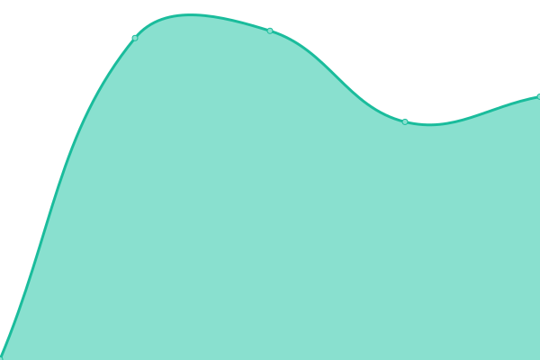 576ms
     
 | 

<a href="https://upptime.solidops.io/history/cashback-posto-karaja">100.00%</a>
    

|  [Posto São Simão](https://postosaosimao.api.postoaki.com/health) | 🟩 Up | [posto-sao-simao.yml](https://github.com/Solidops-io/upptime-postoaki/commits/HEAD/history/posto-sao-simao.yml) | 

 594ms
     
 | 

<a href="https://upptime.solidops.io/history/posto-sao-simao">100.00%</a>
    

|  [Posto Petrols](https://postopetrols.api.postoaki.com/health) | 🟩 Up | [posto-petrols.yml](https://github.com/Solidops-io/upptime-postoaki/commits/HEAD/history/posto-petrols.yml) | 

 583ms
     
 | 

<a href="https://upptime.solidops.io/history/posto-petrols">100.00%</a>
    

|  [Posto Transoja](https://postotransoja.api.postoaki.com/health) | 🟩 Up | [posto-transoja.yml](https://github.com/Solidops-io/upptime-postoaki/commits/HEAD/history/posto-transoja.yml) | 

 574ms
     
 | 

<a href="https://upptime.solidops.io/history/posto-transoja">100.00%</a>
    

|  [TagPlus](https://tagplus.api.postoaki.com/health) | 🟩 Up | [tag-plus.yml](https://github.com/Solidops-io/upptime-postoaki/commits/HEAD/history/tag-plus.yml) | 

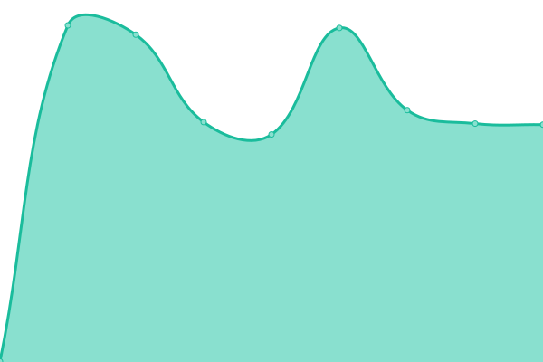 583ms
     
 | 

<a href="https://upptime.solidops.io/history/tag-plus">100.00%</a>
    

|  [Avanx + 3P](https://avanx3p.api.postoaki.com/health) | 🟩 Up | [avanx-3-p.yml](https://github.com/Solidops-io/upptime-postoaki/commits/HEAD/history/avanx-3-p.yml) | 

 578ms
     
 | 

<a href="https://upptime.solidops.io/history/avanx-3-p">100.00%</a>
    

|  [Clube Joia](https://clubejoia.api.postoaki.com/health) | 🟩 Up | [clube-joia.yml](https://github.com/Solidops-io/upptime-postoaki/commits/HEAD/history/clube-joia.yml) | 

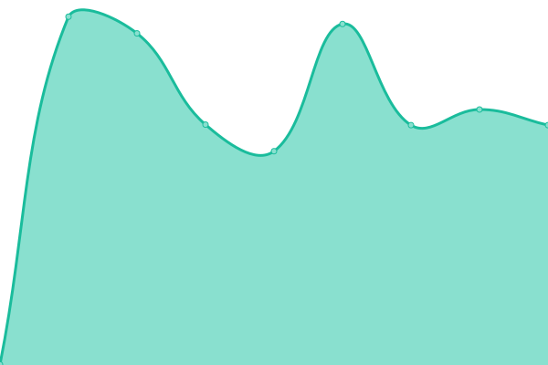 588ms
     
 | 

<a href="https://upptime.solidops.io/history/clube-joia">100.00%</a>
    

|  [São José Fidelidade](https://saojosefidelidade.api.postoaki.com/health) | 🟩 Up | [sao-jose-fidelidade.yml](https://github.com/Solidops-io/upptime-postoaki/commits/HEAD/history/sao-jose-fidelidade.yml) | 

 581ms
     
 | 

<a href="https://upptime.solidops.io/history/sao-jose-fidelidade">100.00%</a>
    

|  [Rede Mimim +](https://redemimim.api.postoaki.com/health) | 🟩 Up | [rede-mimim.yml](https://github.com/Solidops-io/upptime-postoaki/commits/HEAD/history/rede-mimim.yml) | 

 580ms
     
 | 

<a href="https://upptime.solidops.io/history/rede-mimim">100.00%</a>
    

|  [Posto Trevo Betim](https://postotrevobetim.api.postoaki.com/health) | 🟩 Up | [posto-trevo-betim.yml](https://github.com/Solidops-io/upptime-postoaki/commits/HEAD/history/posto-trevo-betim.yml) | 

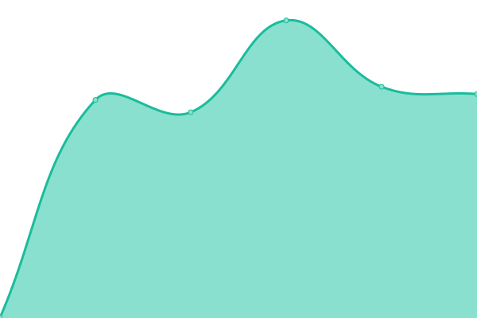 480ms
     
 | 

<a href="https://upptime.solidops.io/history/posto-trevo-betim">100.00%</a>
    

|  [Fideliza Pioneiro](https://fidelizapioneiro.api.postoaki.com/health) | 🟩 Up | [fideliza-pioneiro.yml](https://github.com/Solidops-io/upptime-postoaki/commits/HEAD/history/fideliza-pioneiro.yml) | 

 488ms
     
 | 

<a href="https://upptime.solidops.io/history/fideliza-pioneiro">100.00%</a>
    

|  [Posto Capital do Forro](https://postocapitalforro.api.postoaki.com/health) | 🟩 Up | [posto-capital-do-forro.yml](https://github.com/Solidops-io/upptime-postoaki/commits/HEAD/history/posto-capital-do-forro.yml) | 

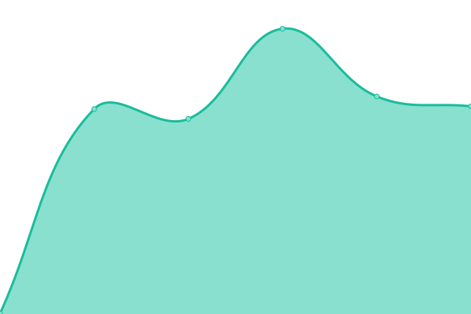 457ms
     
 | 

<a href="https://upptime.solidops.io/history/posto-capital-do-forro">100.00%</a>
    

|  [Posto Titon](https://postotiton.api.postoaki.com/health) | 🟩 Up | [posto-titon.yml](https://github.com/Solidops-io/upptime-postoaki/commits/HEAD/history/posto-titon.yml) | 

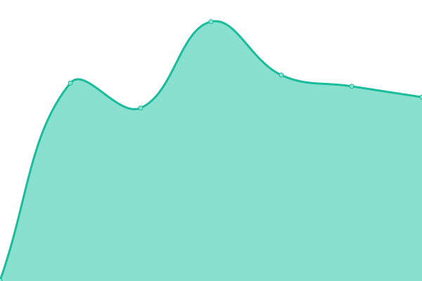 493ms
     
 | 

<a href="https://upptime.solidops.io/history/posto-titon">100.00%</a>
    

|  [Cliente Azul](https://clienteazul.api.postoaki.com/health) | 🟩 Up | [cliente-azul.yml](https://github.com/Solidops-io/upptime-postoaki/commits/HEAD/history/cliente-azul.yml) | 

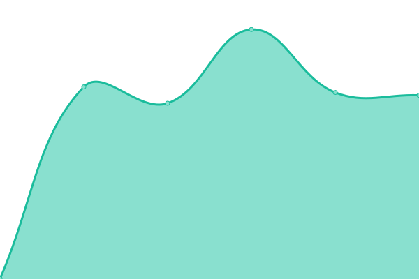 482ms
     
 | 

<a href="https://upptime.solidops.io/history/cliente-azul">100.00%</a>
    

|  [Posto Canoeiro](https://postocanoeiro.api.postoaki.com/health) | 🟩 Up | [posto-canoeiro.yml](https://github.com/Solidops-io/upptime-postoaki/commits/HEAD/history/posto-canoeiro.yml) | 

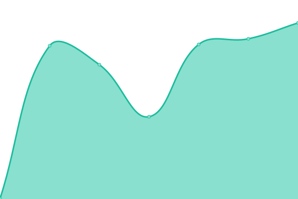 462ms
     
 | 

<a href="https://upptime.solidops.io/history/posto-canoeiro">100.00%</a>
    

|  [Postos Apolo](https://postosapolo.api.postoaki.com/health) | 🟩 Up | [postos-apolo.yml](https://github.com/Solidops-io/upptime-postoaki/commits/HEAD/history/postos-apolo.yml) | 

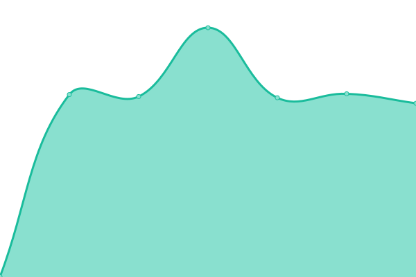 461ms
     
 | 

<a href="https://upptime.solidops.io/history/postos-apolo">100.00%</a>
    

|  [Rede Gaia +](https://redegaia.api.postoaki.com/health) | 🟩 Up | [rede-gaia.yml](https://github.com/Solidops-io/upptime-postoaki/commits/HEAD/history/rede-gaia.yml) | 

 488ms
     
 | 

<a href="https://upptime.solidops.io/history/rede-gaia">100.00%</a>
    

|  [Clube Pegasus](https://clubepegasus.api.postoaki.com/health) | 🟩 Up | [clube-pegasus.yml](https://github.com/Solidops-io/upptime-postoaki/commits/HEAD/history/clube-pegasus.yml) | 

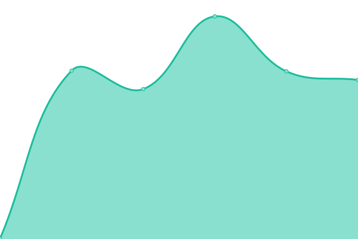 493ms
     
 | 

<a href="https://upptime.solidops.io/history/clube-pegasus">100.00%</a>
    

|  [Martinzinho](https://martinzinho.api.postoaki.com/health) | 🟩 Up | [martinzinho.yml](https://github.com/Solidops-io/upptime-postoaki/commits/HEAD/history/martinzinho.yml) | 

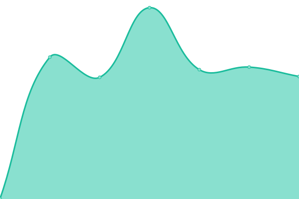 499ms
     
 | 

<a href="https://upptime.solidops.io/history/martinzinho">100.00%</a>
    

|  [Abastece Yas](https://abasteceyas.api.postoaki.com/health) | 🟩 Up | [abastece-yas.yml](https://github.com/Solidops-io/upptime-postoaki/commits/HEAD/history/abastece-yas.yml) | 

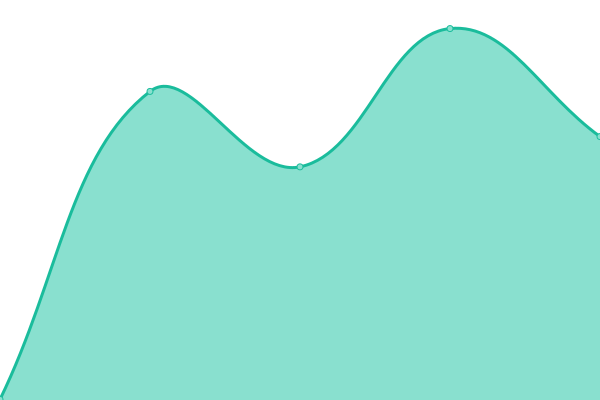 540ms
     
 | 

<a href="https://upptime.solidops.io/history/abastece-yas">100.00%</a>
    

|  [Posto Hikari](https://postohikari.api.postoaki.com/health) | 🟩 Up | [posto-hikari.yml](https://github.com/Solidops-io/upptime-postoaki/commits/HEAD/history/posto-hikari.yml) | 

 462ms
     
 | 

<a href="https://upptime.solidops.io/history/posto-hikari">100.00%</a>
    

|  [Rede Itavel](https://redeitavel.api.postoaki.com/health) | 🟩 Up | [rede-itavel.yml](https://github.com/Solidops-io/upptime-postoaki/commits/HEAD/history/rede-itavel.yml) | 

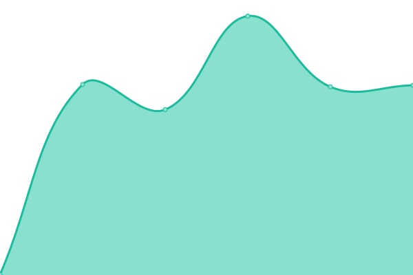 485ms
     
 | 

<a href="https://upptime.solidops.io/history/rede-itavel">100.00%</a>
    

|  [Postos Santana Fidelidade](https://postossantana.api.postoaki.com/health) | 🟩 Up | [postos-santana-fidelidade.yml](https://github.com/Solidops-io/upptime-postoaki/commits/HEAD/history/postos-santana-fidelidade.yml) | 

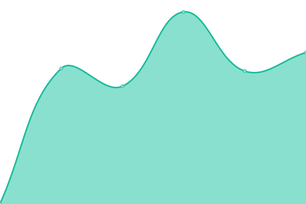 465ms
     
 | 

<a href="https://upptime.solidops.io/history/postos-santana-fidelidade">100.00%</a>
    

|  [Posto Pioneiro](https://postopioneiro.api.postoaki.com/health) | 🟩 Up | [posto-pioneiro.yml](https://github.com/Solidops-io/upptime-postoaki/commits/HEAD/history/posto-pioneiro.yml) | 

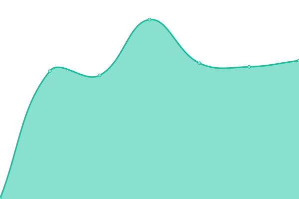 450ms
     
 | 

<a href="https://upptime.solidops.io/history/posto-pioneiro">100.00%</a>
    

|  [Petro Fuel](https://petrofuel.api.postoaki.com/health) | 🟩 Up | [petro-fuel.yml](https://github.com/Solidops-io/upptime-postoaki/commits/HEAD/history/petro-fuel.yml) | 

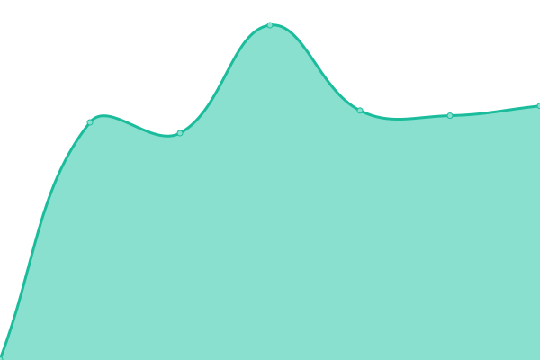 462ms
     
 | 

<a href="https://upptime.solidops.io/history/petro-fuel">100.00%</a>
    

|  [EcoJardim](https://ecojardim.api.postoaki.com/health) | 🟩 Up | [eco-jardim.yml](https://github.com/Solidops-io/upptime-postoaki/commits/HEAD/history/eco-jardim.yml) | 

 467ms
     
 | 

<a href="https://upptime.solidops.io/history/eco-jardim">100.00%</a>
    

|  [Petrosol](https://petrosol.api.postoaki.com/health) | 🟩 Up | [petrosol.yml](https://github.com/Solidops-io/upptime-postoaki/commits/HEAD/history/petrosol.yml) | 

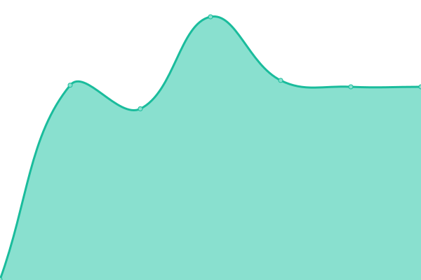 487ms
     
 | 

<a href="https://upptime.solidops.io/history/petrosol">100.00%</a>
    

|  [Posto Sertão](https://postosertao.api.postoaki.com/health) | 🟩 Up | [posto-sertao.yml](https://github.com/Solidops-io/upptime-postoaki/commits/HEAD/history/posto-sertao.yml) | 

 485ms
     
 | 

<a href="https://upptime.solidops.io/history/posto-sertao">100.00%</a>
    

|  [Abastece Aki](https://abasteceaki.api.postoaki.com/health) | 🟩 Up | [abastece-aki.yml](https://github.com/Solidops-io/upptime-postoaki/commits/HEAD/history/abastece-aki.yml) | 

 489ms
     
 | 

<a href="https://upptime.solidops.io/history/abastece-aki">100.00%</a>
    

|  [Rede AF](https://redeaf.api.postoaki.com/health) | 🟩 Up | [rede-af.yml](https://github.com/Solidops-io/upptime-postoaki/commits/HEAD/history/rede-af.yml) | 

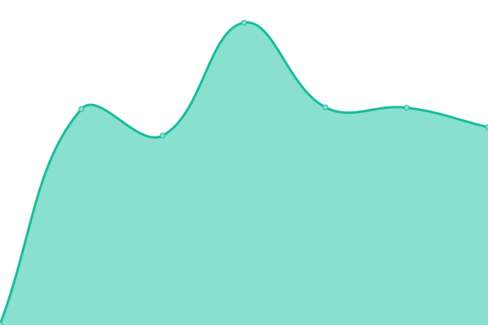 465ms
     
 | 

<a href="https://upptime.solidops.io/history/rede-af">100.00%</a>
    

|  [Rede Antonelli](https://redeantonelli.api.postoaki.com/health) | 🟩 Up | [rede-antonelli.yml](https://github.com/Solidops-io/upptime-postoaki/commits/HEAD/history/rede-antonelli.yml) | 

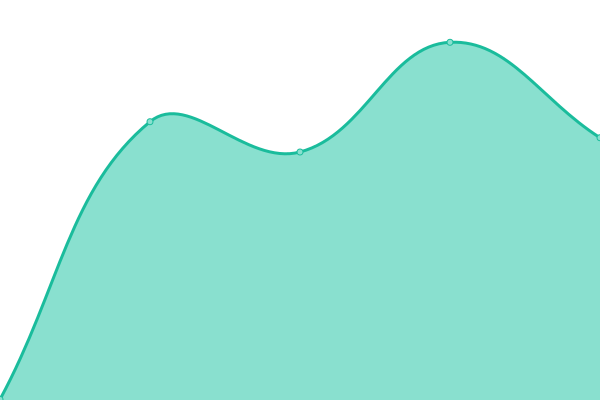 487ms
     
 | 

<a href="https://upptime.solidops.io/history/rede-antonelli">100.00%</a>
    

|  [Posto do Binha](https://postobinha.api.postoaki.com/health) | 🟩 Up | [posto-do-binha.yml](https://github.com/Solidops-io/upptime-postoaki/commits/HEAD/history/posto-do-binha.yml) | 

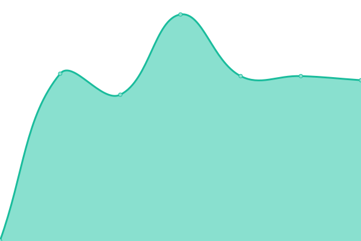 486ms
     
 | 

<a href="https://upptime.solidops.io/history/posto-do-binha">100.00%</a>
    

|  [Rede Gruta](https://redegruta.api.postoaki.com/health) | 🟩 Up | [rede-gruta.yml](https://github.com/Solidops-io/upptime-postoaki/commits/HEAD/history/rede-gruta.yml) | 

 469ms
     
 | 

<a href="https://upptime.solidops.io/history/rede-gruta">100.00%</a>
    

|  [Clube Magnata](https://clubemagnata.api.postoaki.com/health) | 🟩 Up | [clube-magnata.yml](https://github.com/Solidops-io/upptime-postoaki/commits/HEAD/history/clube-magnata.yml) | 

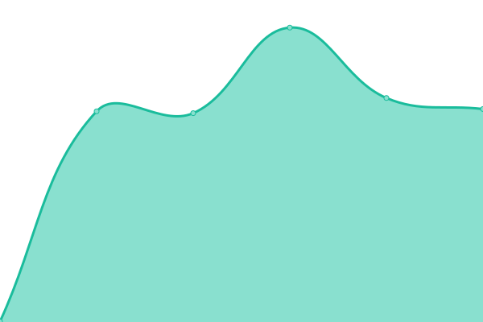 458ms
     
 | 

<a href="https://upptime.solidops.io/history/clube-magnata">100.00%</a>
    

|  [Atos Fideliza](https://atosfideliza.api.postoaki.com/health) | 🟩 Up | [atos-fideliza.yml](https://github.com/Solidops-io/upptime-postoaki/commits/HEAD/history/atos-fideliza.yml) | 

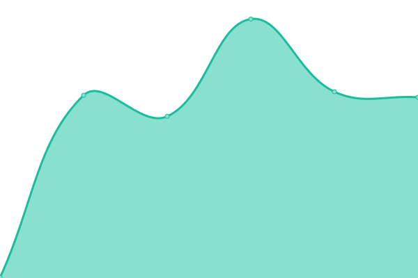 460ms
     
 | 

<a href="https://upptime.solidops.io/history/atos-fideliza">100.00%</a>
    

|  [Rede Abreu](https://redeabreu.api.postoaki.com/health) | 🟩 Up | [rede-abreu.yml](https://github.com/Solidops-io/upptime-postoaki/commits/HEAD/history/rede-abreu.yml) | 

 490ms
     
 | 

<a href="https://upptime.solidops.io/history/rede-abreu">100.00%</a>
    

|  [Cashback Mãe Rainha](https://cashbackmaerainha.api.postoaki.com/health) | 🟩 Up | [cashback-mae-rainha.yml](https://github.com/Solidops-io/upptime-postoaki/commits/HEAD/history/cashback-mae-rainha.yml) | 

 462ms
     
 | 

<a href="https://upptime.solidops.io/history/cashback-mae-rainha">100.00%</a>
    

|  [Postos Catarina](https://postoscatarina.api.postoaki.com/health) | 🟩 Up | [postos-catarina.yml](https://github.com/Solidops-io/upptime-postoaki/commits/HEAD/history/postos-catarina.yml) | 

 497ms
     
 | 

<a href="https://upptime.solidops.io/history/postos-catarina">100.00%</a>
    

|  [Posto Michellos](https://postomichellos.api.postoaki.com/health) | 🟩 Up | [posto-michellos.yml](https://github.com/Solidops-io/upptime-postoaki/commits/HEAD/history/posto-michellos.yml) | 

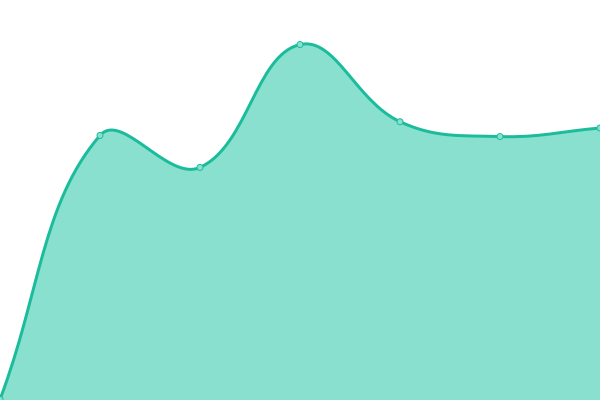 463ms
     
 | 

<a href="https://upptime.solidops.io/history/posto-michellos">100.00%</a>
    

|  [Progresso Points](https://progressopoints.api.postoaki.com/health) | 🟩 Up | [progresso-points.yml](https://github.com/Solidops-io/upptime-postoaki/commits/HEAD/history/progresso-points.yml) | 

 466ms
     
 | 

<a href="https://upptime.solidops.io/history/progresso-points">100.00%</a>
    

|  [RP3 Combustíveis](https://rp3combustiveis.api.postoaki.com/health) | 🟩 Up | [rp-3-combustiveis.yml](https://github.com/Solidops-io/upptime-postoaki/commits/HEAD/history/rp-3-combustiveis.yml) | 

 492ms
     
 | 

<a href="https://upptime.solidops.io/history/rp-3-combustiveis">100.00%</a>
    

|  [Posto Abl](https://postoabl.api.postoaki.com/health) | 🟩 Up | [posto-abl.yml](https://github.com/Solidops-io/upptime-postoaki/commits/HEAD/history/posto-abl.yml) | 

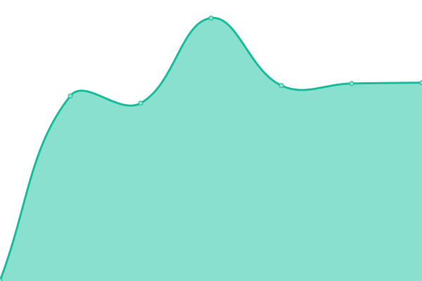 461ms
     
 | 

<a href="https://upptime.solidops.io/history/posto-abl">100.00%</a>
    

|  [Posto Bandeirante](https://postobandeirante.api.postoaki.com/health) | 🟩 Up | [posto-bandeirante.yml](https://github.com/Solidops-io/upptime-postoaki/commits/HEAD/history/posto-bandeirante.yml) | 

 501ms
     
 | 

<a href="https://upptime.solidops.io/history/posto-bandeirante">100.00%</a>
    

|  [Rede Comendador](https://redecomendador.api.postoaki.com/health) | 🟩 Up | [rede-comendador.yml](https://github.com/Solidops-io/upptime-postoaki/commits/HEAD/history/rede-comendador.yml) | 

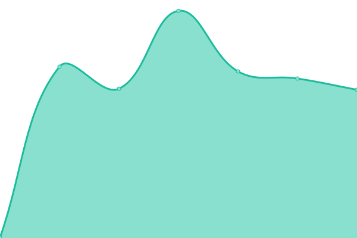 504ms
     
 | 

<a href="https://upptime.solidops.io/history/rede-comendador">100.00%</a>
    

|  [Tanque de Vantagens](https://tanquedevantagens.api.postoaki.com/health) | 🟩 Up | [tanque-de-vantagens.yml](https://github.com/Solidops-io/upptime-postoaki/commits/HEAD/history/tanque-de-vantagens.yml) | 

 501ms
     
 | 

<a href="https://upptime.solidops.io/history/tanque-de-vantagens">100.00%</a>
    

|  [Clientes VIP](https://vip.api.postoaki.com/health) | 🟩 Up | [clientes-vip.yml](https://github.com/Solidops-io/upptime-postoaki/commits/HEAD/history/clientes-vip.yml) | 

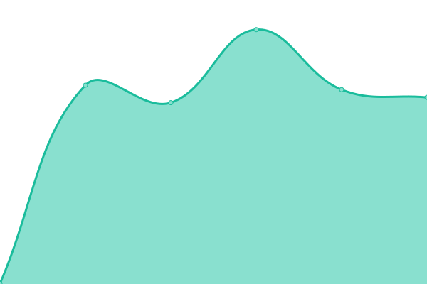 490ms
     
 | 

<a href="https://upptime.solidops.io/history/clientes-vip">100.00%</a>
    

|  [Seven Fidelidade](https://tanquecheioseven.api.postoaki.com/health) | 🟩 Up | [seven-fidelidade.yml](https://github.com/Solidops-io/upptime-postoaki/commits/HEAD/history/seven-fidelidade.yml) | 

 486ms
     
 | 

<a href="https://upptime.solidops.io/history/seven-fidelidade">100.00%</a>
    

|  [Posto Itália](https://postoitalia.api.postoaki.com/health) | 🟩 Up | [posto-italia.yml](https://github.com/Solidops-io/upptime-postoaki/commits/HEAD/history/posto-italia.yml) | 

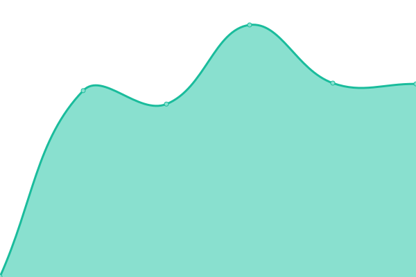 471ms
     
 | 

<a href="https://upptime.solidops.io/history/posto-italia">100.00%</a>
    

|  [CompletAki](https://completaki.api.postoaki.com/health) | 🟩 Up | [complet-aki.yml](https://github.com/Solidops-io/upptime-postoaki/commits/HEAD/history/complet-aki.yml) | 

 465ms
     
 | 

<a href="https://upptime.solidops.io/history/complet-aki">100.00%</a>
    

|  [MaxSul SLO](https://maxsulslo.api.postoaki.com/health) | 🟩 Up | [max-sul-slo.yml](https://github.com/Solidops-io/upptime-postoaki/commits/HEAD/history/max-sul-slo.yml) | 

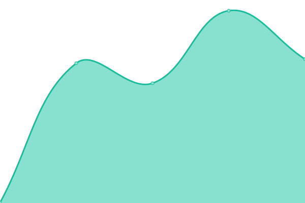 482ms
     
 | 

<a href="https://upptime.solidops.io/history/max-sul-slo">100.00%</a>
    

|  [CVR+](https://cvrmais.api.postoaki.com/health) | 🟩 Up | [cvr.yml](https://github.com/Solidops-io/upptime-postoaki/commits/HEAD/history/cvr.yml) | 

 461ms
     
 | 

<a href="https://upptime.solidops.io/history/cvr">100.00%</a>
    

|  [Fideliza Luz da Lua](https://fidelizaluzdalua.api.postoaki.com/health) | 🟩 Up | [fideliza-luz-da-lua.yml](https://github.com/Solidops-io/upptime-postoaki/commits/HEAD/history/fideliza-luz-da-lua.yml) | 

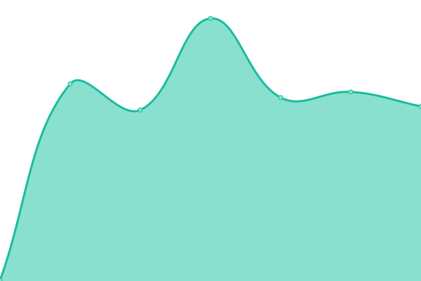 491ms
     
 | 

<a href="https://upptime.solidops.io/history/fideliza-luz-da-lua">100.00%</a>
    

|  [Postos Machadao](https://postosmachadao.api.postoaki.com/health) | 🟩 Up | [postos-machadao.yml](https://github.com/Solidops-io/upptime-postoaki/commits/HEAD/history/postos-machadao.yml) | 

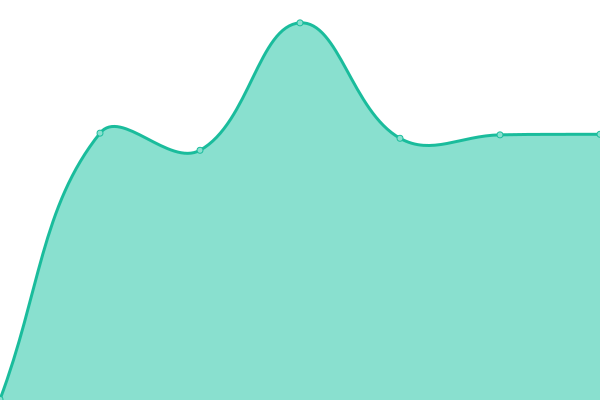 467ms
     
 | 

<a href="https://upptime.solidops.io/history/postos-machadao">100.00%</a>
    

|  [Poupe Mais](https://poupemais.api.postoaki.com/health) | 🟩 Up | [poupe-mais.yml](https://github.com/Solidops-io/upptime-postoaki/commits/HEAD/history/poupe-mais.yml) | 

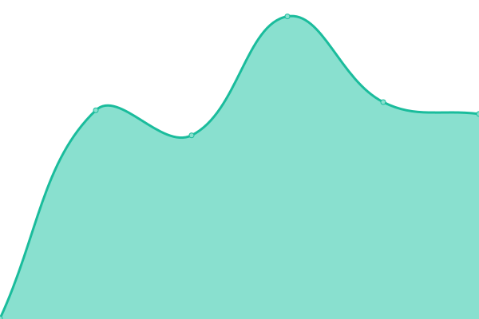 458ms
     
 | 

<a href="https://upptime.solidops.io/history/poupe-mais">100.00%</a>
    

|  [Nova América](https://novaamerica.api.postoaki.com/health) | 🟩 Up | [nova-america.yml](https://github.com/Solidops-io/upptime-postoaki/commits/HEAD/history/nova-america.yml) | 

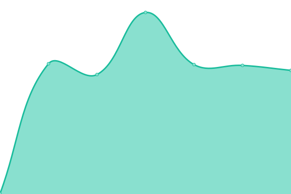 470ms
     
 | 

<a href="https://upptime.solidops.io/history/nova-america">100.00%</a>
    

|  [Grupo PW](https://grupopw.api.postoaki.com/health) | 🟩 Up | [grupo-pw.yml](https://github.com/Solidops-io/upptime-postoaki/commits/HEAD/history/grupo-pw.yml) | 

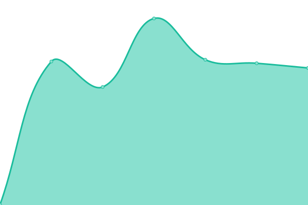 490ms
     
 | 

<a href="https://upptime.solidops.io/history/grupo-pw">100.00%</a>
    

|  [Rede Millenium](https://redemillenium.api.postoaki.com/health) | 🟩 Up | [rede-millenium.yml](https://github.com/Solidops-io/upptime-postoaki/commits/HEAD/history/rede-millenium.yml) | 

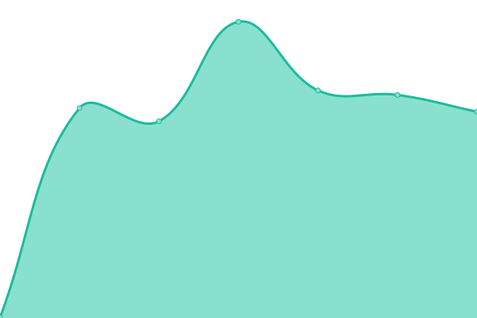 462ms
     
 | 

<a href="https://upptime.solidops.io/history/rede-millenium">100.00%</a>
    

|  [Rede Posto 7](https://redepostosete.api.postoaki.com/health) | 🟩 Up | [rede-posto-7.yml](https://github.com/Solidops-io/upptime-postoaki/commits/HEAD/history/rede-posto-7.yml) | 

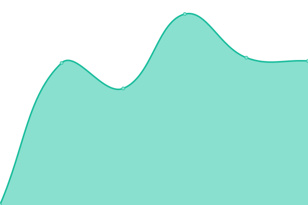 485ms
     
 | 

<a href="https://upptime.solidops.io/history/rede-posto-7">100.00%</a>
    

|  [Posto Copa](https://postocopa.api.postoaki.com/health) | 🟩 Up | [posto-copa.yml](https://github.com/Solidops-io/upptime-postoaki/commits/HEAD/history/posto-copa.yml) | 

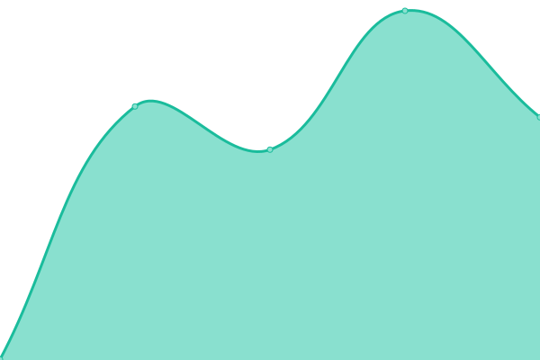 493ms
     
 | 

<a href="https://upptime.solidops.io/history/posto-copa">100.00%</a>
    

|  [Rodo Rodoil JBA](https://postosrodoiljba.api.postoaki.com/health) | 🟩 Up | [rodo-rodoil-jba.yml](https://github.com/Solidops-io/upptime-postoaki/commits/HEAD/history/rodo-rodoil-jba.yml) | 

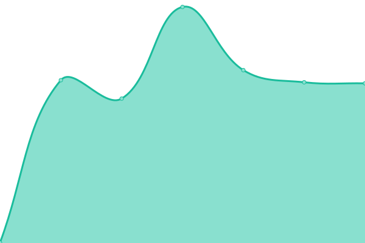 469ms
     
 | 

<a href="https://upptime.solidops.io/history/rodo-rodoil-jba">100.00%</a>
    

|  [Rede Meta](https://redemeta.api.postoaki.com/health) | 🟩 Up | [rede-meta.yml](https://github.com/Solidops-io/upptime-postoaki/commits/HEAD/history/rede-meta.yml) | 

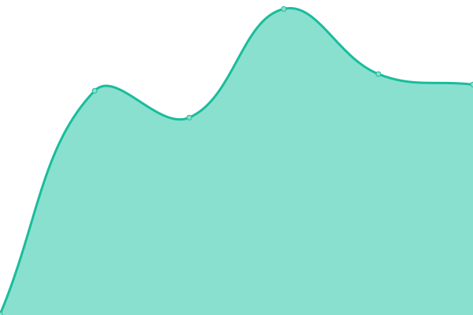 427ms
     
 | 

<a href="https://upptime.solidops.io/history/rede-meta">100.00%</a>
    

<!--end: status pages-->

[**Visit our status website →**](https://upptime.solidops.io)

## 📄 License

- Powered by: [Upptime](https://github.com/upptime/upptime)
- Code: [MIT](./LICENSE) © [Anand Chowdhary](https://anandchowdhary.com), supported by [Pabio](https://pabio.com)
- Data in the `./history` directory: [Open Database License](https://opendatacommons.org/licenses/odbl/1-0/)
