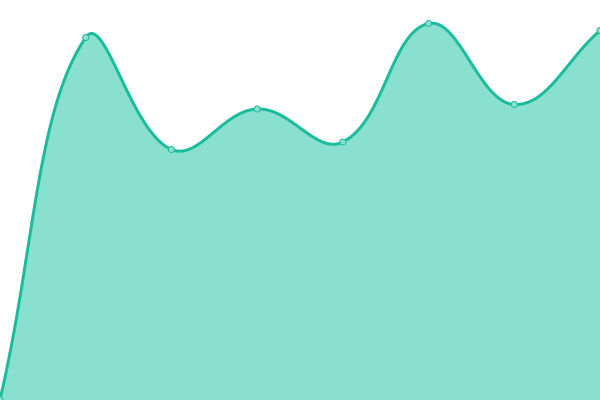
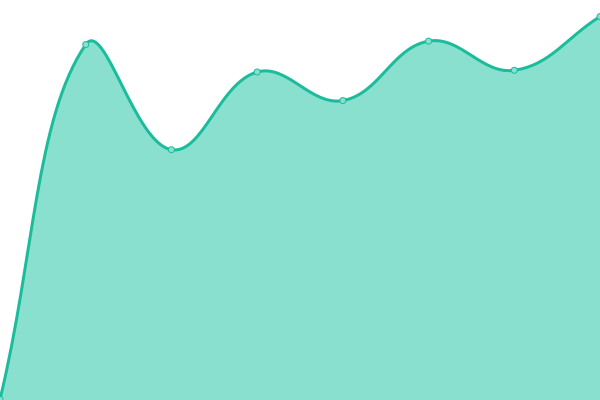
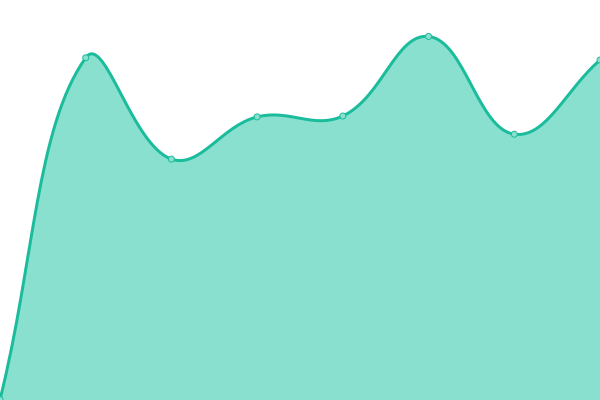
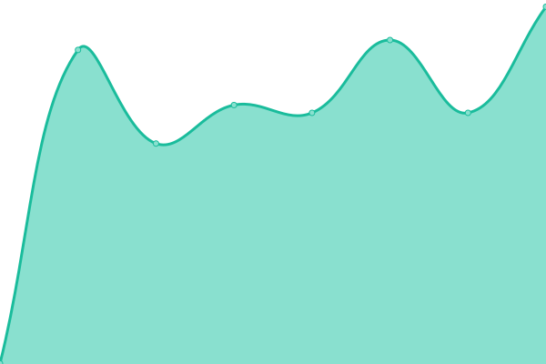
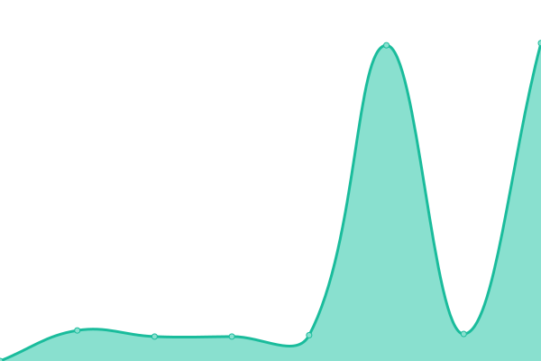

# [📈 Live Status](https://upptime.solidops.io): <!--live status--> **🟩 All systems operational**

This repository contains the open-source uptime monitor and status page for [Solidops-io](https://upptime.solidops.io), powered by [Upptime](https://github.com/upptime/upptime).

With [Upptime](https://upptime.js.org), you can get your own unlimited and free uptime monitor and status page, powered entirely by a GitHub repository. We use [Issues](https://github.com/Solidops-io/upptime/issues) as incident reports, [Actions](https://github.com/Solidops-io/upptime/actions) as uptime monitors, and [Pages](https://upptime.solidops.io) for the status page.

<!--start: status pages-->
<!-- This summary is generated by Upptime (https://github.com/upptime/upptime) -->
<!-- Do not edit this manually, your changes will be overwritten -->
<!-- prettier-ignore -->
| URL | Status | History | Response Time | Uptime |
| --- | ------ | ------- | ------------- | ------ |
|  [Api PostoAki](https://redemeta.api.postoaki.com/health) | 🟩 Up | [api-posto-aki.yml](https://github.com/Solidops-io/upptime-postoaki/commits/HEAD/history/api-posto-aki.yml) | 

 670ms
     
 | 

<a href="https://upptime.postoaki.app/history/api-posto-aki">99.65%</a>
    

|  [Grafana](https://grafana.postoaki.app) | 🟩 Up | [grafana.yml](https://github.com/Solidops-io/upptime-postoaki/commits/HEAD/history/grafana.yml) | 

 1029ms
     
 | 

<a href="https://upptime.postoaki.app/history/grafana">100.00%</a>
    

|  [Painel PostoAki](https://painel.postoaki.com.br) | 🟩 Up | [painel-posto-aki.yml](https://github.com/Solidops-io/upptime-postoaki/commits/HEAD/history/painel-posto-aki.yml) | 

 642ms
     
 | 

<a href="https://upptime.postoaki.app/history/painel-posto-aki">100.00%</a>
    

|  [Painel Frota](https://painelfrota.postoaki.com.br) | 🟩 Up | [painel-frota.yml](https://github.com/Solidops-io/upptime-postoaki/commits/HEAD/history/painel-frota.yml) | 

 770ms
     
 | 

<a href="https://upptime.postoaki.app/history/painel-frota">100.00%</a>
    

|  [Redirect PostoAki](https://redirect.postoaki.com.br) | 🟩 Up | [redirect-posto-aki.yml](https://github.com/Solidops-io/upptime-postoaki/commits/HEAD/history/redirect-posto-aki.yml) | 

 562ms
     
 | 

<a href="https://upptime.postoaki.app/history/redirect-posto-aki">100.00%</a>
    

|  [Painel Venda](https://painelvenda.postoaki.com.br) | 🟩 Up | [painel-venda.yml](https://github.com/Solidops-io/upptime-postoaki/commits/HEAD/history/painel-venda.yml) | 

 723ms
     
 | 

<a href="https://upptime.postoaki.app/history/painel-venda">100.00%</a>
    

|  [Wiki PostoAki](https://wiki.postoaki.com.br) | 🟩 Up | [wiki-posto-aki.yml](https://github.com/Solidops-io/upptime-postoaki/commits/HEAD/history/wiki-posto-aki.yml) | 

 584ms
     
 | 

<a href="https://upptime.postoaki.app/history/wiki-posto-aki">100.00%</a>
    

|  [Site PostoAki](https://www.postoaki.com.br) | 🟩 Up | [site-posto-aki.yml](https://github.com/Solidops-io/upptime-postoaki/commits/HEAD/history/site-posto-aki.yml) | 

 1403ms
     
 | 

<a href="https://upptime.postoaki.app/history/site-posto-aki">100.00%</a>
    

<!--end: status pages-->

[**Visit our status website →**](https://upptime.solidops.io)

## 📄 License

- Powered by: [Upptime](https://github.com/upptime/upptime)
- Code: [MIT](./LICENSE) © [Anand Chowdhary](https://anandchowdhary.com), supported by [Pabio](https://pabio.com)
- Data in the `./history` directory: [Open Database License](https://opendatacommons.org/licenses/odbl/1-0/)
